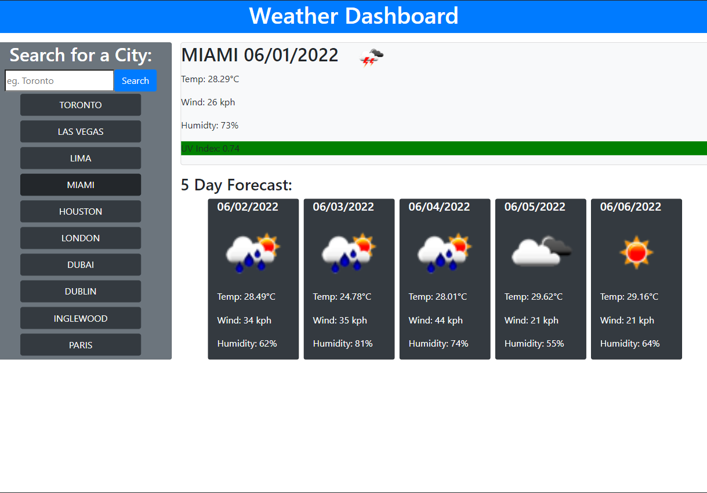

# 06 Server Side APIs Challenge: Weather Dashboard
 
## Description
 
This project is a single webpage that consists of a dashboard for checking the weather.

A User can look up the weather for multiple cities and get the current conditions and future forecast. The app allows a user to save up to ten previous search options for easy look-up. Ideally the app can be used by a traveler to plan a trip.
 
## Usage
 
The website is live on the open web and can be accessed at https://abdallajama201.github.io/Weather-Dashboard/

When a user opens the webpage for the first time they are presented with a search field they can input a city name in. When the user presses submit or the enter key the page is populated with the weather conditions and forecast. The search is also saved under the input field.

A photo of the mockup is available below.
 

  
## Credits
 
Weather data is provided by the [OpenWeather One Call API](https://openweathermap.org/api/one-call-api).
 
## License
 
 This project is under the MIT License with language provided by the Open Source Initiative.
